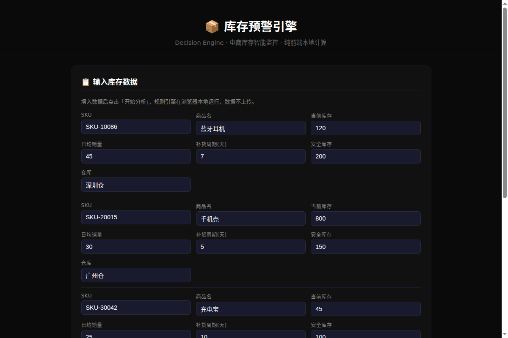

# Decision Engine

通用业务规则引擎 + 多Agent协作框架，从量化交易系统抽象而来。

## 🚀 在线演示

**[→ 库存预警引擎在线Demo](https://www.aialter.site/resume/decision-engine/)**

打开即用，纯前端本地计算，数据不上传。



## 架构

```
┌─────────────────────────────────────────┐
│           execution_layer               │
│     自动化执行 + 风控拦截 + 审计日志      │
├─────────────────────────────────────────┤
│           agent_collab                  │
│   多AI协作编排 + 消息队列 + 任务分发      │
├─────────────────────────────────────────┤
│           decision_layer                │
│     规则引擎 + 异常检测 + Regime判断      │
├─────────────────────────────────────────┤
│           data_layer                    │
│     实时数据采集 + 清洗 + 标准化          │
└─────────────────────────────────────────┘
```

## 架构来源

本项目从 A股量化交易系统「猎手」抽象而来，原始架构包含：
- 实时行情采集（5秒级延迟，覆盖全市场）
- 28条量化交易规则引擎（自动拦截高风险操作）
- 3个AI Agent协作框架（消息队列任务分发）
- 自动化交易执行系统（风控拦截+日志审计+回测验证）

**该架构已在A股实时交易场景连续运行并验证，现泛化为通用业务决策引擎。**

## 场景示例

| 场景 | 规则引擎 | 数据层 | 执行层 |
|------|---------|--------|--------|
| 量化交易 | 交易信号过滤 | 行情数据 | 下单执行 |
| 电商库存 | 异常订单拦截 | 订单数据 | 自动补货 |
| 供应链 | 成本异常检测 | 采购数据 | 预警通知 |
| 设备运维 | 故障预测 | 传感器数据 | 自动工单 |

## 快速开始

```bash
git clone git@github.com:eninem123/agent-decision-engine.git
cd agent-decision-engine
python3 examples/stock_demo.py
```

## License

MIT
